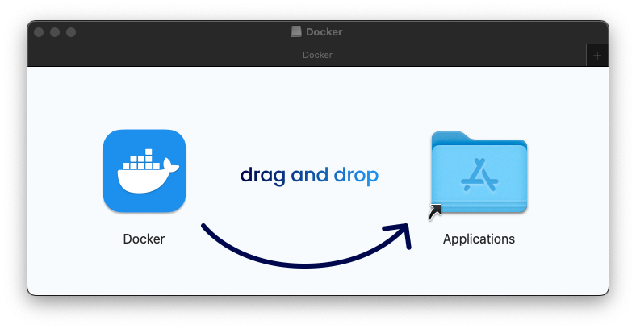
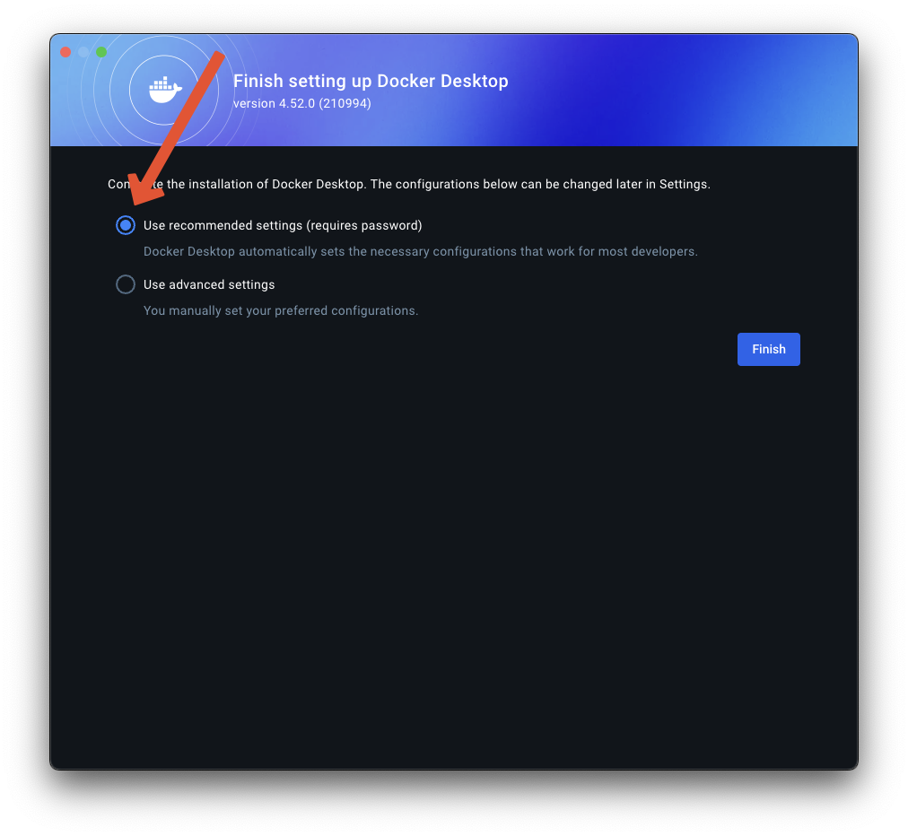
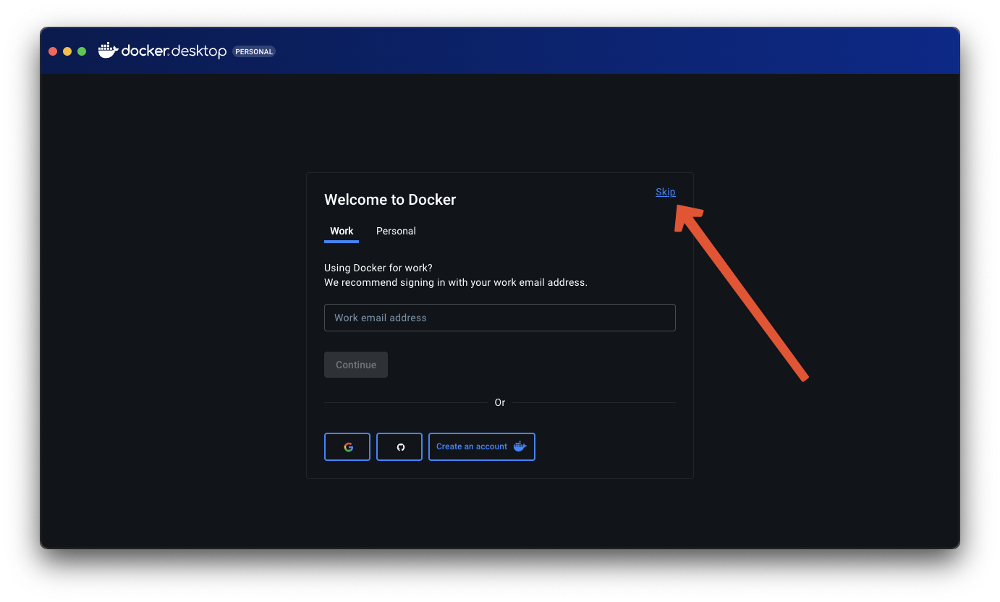
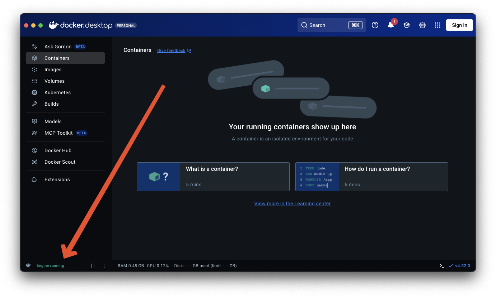

# Docker

In order to run this containerized version of Anacapa, you'll need Docker installed and running.

We'll assume you have never used Docker before, and that you're using a desktop or laptop computer, not a server. Those using installing to a server should see [this page](https://docs.docker.com/engine/install).

### Download

You're going to be using Docker Desktop for this tutorial. Download here:

- [MacOS - ARM64 (Apple Silicon)](https://desktop.docker.com/mac/main/arm64/Docker.dmg)
- [MacOS - AMD64 (Intel)](https://desktop.docker.com/mac/main/amd64/Docker.dmg)
- [Windows - ARM64 (Qualcomm)](https://desktop.docker.com/win/main/arm64/Docker%20Desktop%20Installer.exe)
- [Windows - AMD64 (Intel, AMD)](https://desktop.docker.com/win/main/amd64/Docker%20Desktop%20Installer.exe)
- [Linux (Separate Docs)](https://docs.docker.com/desktop/setup/install/linux/)

### Setup

Once you've downloaded the installer, run it. On MacOS this is a mountable Disk Image. Like with any app installation, simply drag and drop the Docker application to the provided Applications folder alias.



Once installed, launch Docker Desktop.

It will ask you which settings to use. Ensure that the recommended settings are selected, then click "Finish".



You will be prompted with a sign-in screen. Simply click "Skip".



You will then be brought to the Docker Desktop home screen. If everything is working correctly, it will say "Engine Running" in the lower left corner.



As a final check, open your terminal, and run the following:
```bash
which docker
```
It should output a filepath, something like `/usr/local/bin/docker`, though it may differ from system to system.